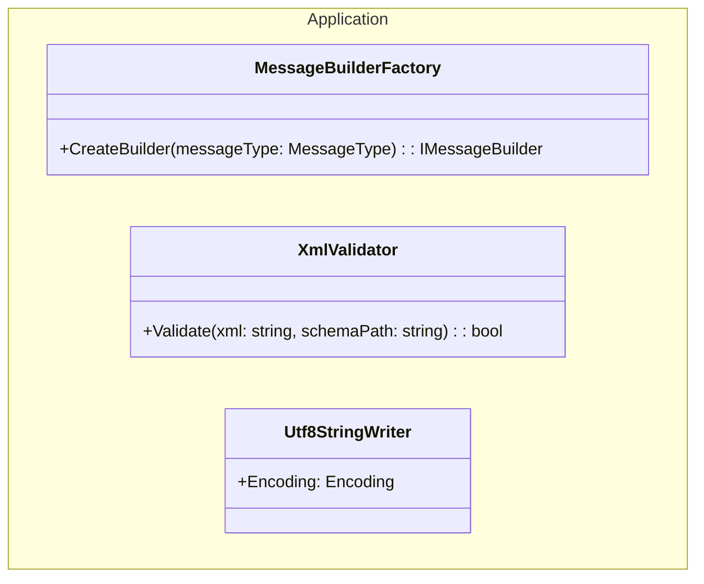
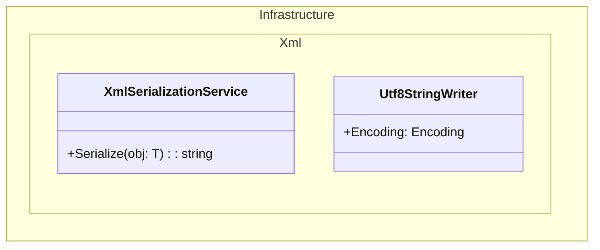
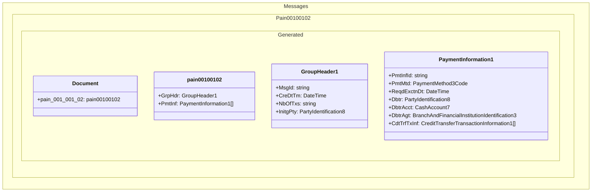
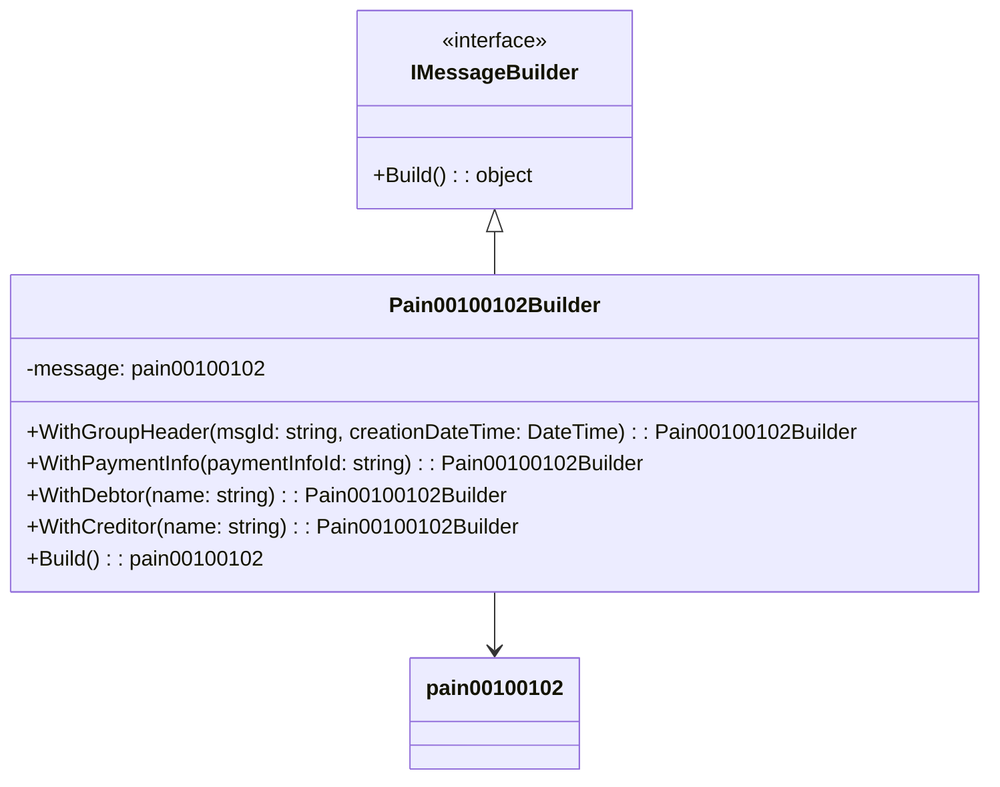
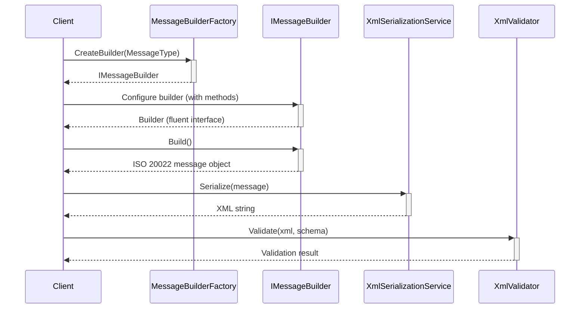

# Architecture and Design

## Project Structure

Iso20022Library follows a clean architecture approach with distinct layers:

```
Iso20022Library/
├── Application/       # Application services, validators, builders
├── Domain/           # Core business logic and entities
├── Infrastructure/   # External concerns (serialization, etc.)
├── Messages/         # Generated ISO 20022 message classes
└── Tests/            # Unit tests
```

## Class Diagrams

### Domain Layer

The Domain layer contains the core entities and interfaces for the application.

```mermaid
classDiagram
    namespace Domain.Common {
        class Enums {
            +MessageType
        }
        interface IMessageBuilder {
            +Build() : object
        }
    }
```

### Application Layer

The Application layer contains the business logic and implements the domain interfaces.



### Infrastructure Layer

The Infrastructure layer handles external concerns like XML serialization.



### Messages Layer

The Messages layer contains the auto-generated classes from ISO 20022 XSD schemas.



### Builders

The builder pattern is used to simplify the creation of complex ISO 20022 messages.



## Component Interactions

The following diagram illustrates how the components interact to generate an ISO 20022 message:



## Design Patterns

The library uses several design patterns:

1. **Builder Pattern** - For constructing complex ISO 20022 message objects
2. **Factory Pattern** - For creating the appropriate builder based on message type
3. **Strategy Pattern** - For handling different message validation strategies
4. **Adapter Pattern** - For adapting domain objects to ISO 20022 message format

## Extensibility

The library is designed to be extensible:

- New message types can be added by generating code from XSD and implementing a new builder
- The factory pattern allows for easy addition of new message builders
- The clean architecture approach separates concerns and makes modification easier
